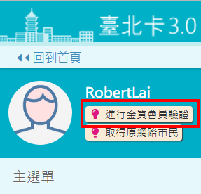

# Q3.要如何成為金質會員呢?

## 使用者成為金質會員的方式有二種:

## 1.線上作業 :一般會員升級為金質會員

### step1 使用者透過線上認證\(手機認證、電子郵件認證\)或經由手機安裝\[行動臺北卡\]應用程式註冊成為一般會員。

### step2 使用者以一般會員身分登入系統，在個人資料維護功能裡，點擊 \[金質會員認證\] ，透過 自然人憑證認證成功來升級成金質會員。

#### 1.進行金質會員認證

## 2.線下作業: 透過臨櫃服務人員協助，註冊成為金質會員

### -- 使用者到各戶政事務所，提供相關文件證明，透過臨櫃服務人員協助申請註冊為金質會員。

